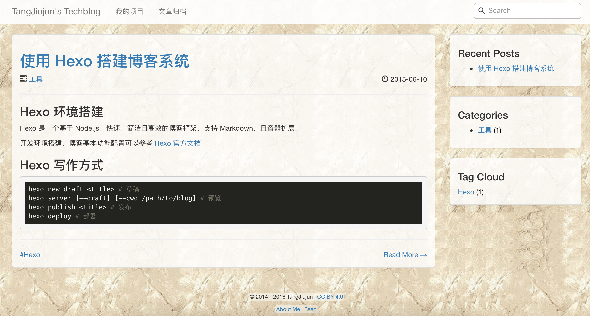

# hexo-theme-shed
>A pure and fresh hexo theme that crafted with jQuery and Bootstrap.

### Features
* Responsive layout
* List categories and tags in sidebar
* Highlight code with Highlight.js
* Delay load Duoshuo comment
* Delay load Swiftype Search
* Change backgound image per 10 minutes

### Screenshots



### Install
Execute the following command and modify theme in `_config.yml` to shed.

```bash
git clone https://github.com/tangjiujun/hexo-theme-shed.git themes/shed
```

### Configuration

```yaml
menu:
  Archives: /archives

duoshuo_short_name: 'duoshuo short name'

links:
  about: /about.html
  feed: /atom.xml

site_start_time: 'site start time'

swiftype_key: 'swiftype key'
```

### Front-matter

```yaml
# Recommand post front-matter
# scaffolds/post.md
title: {{ title }}
date: {{ date }}
category: 
tags:
```

